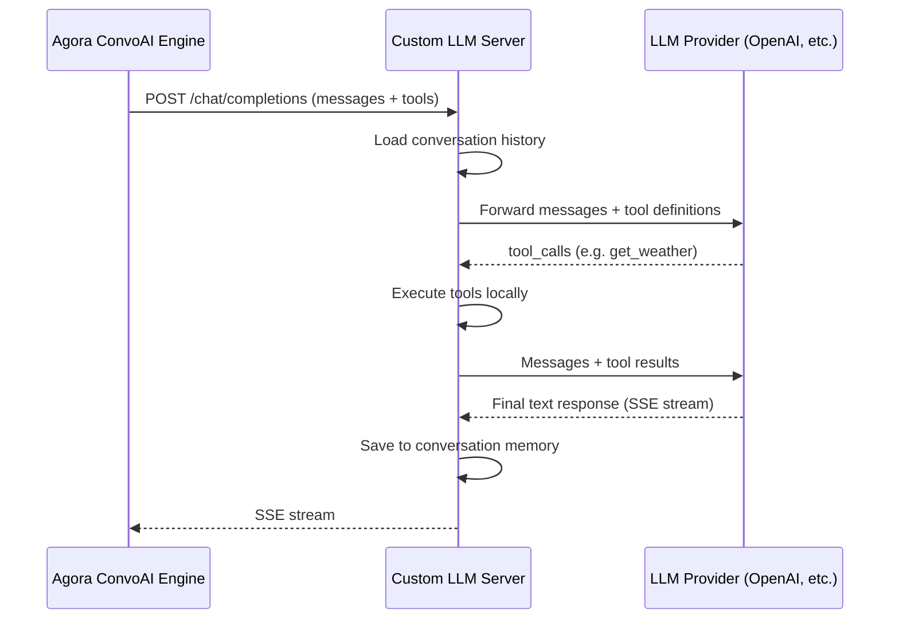
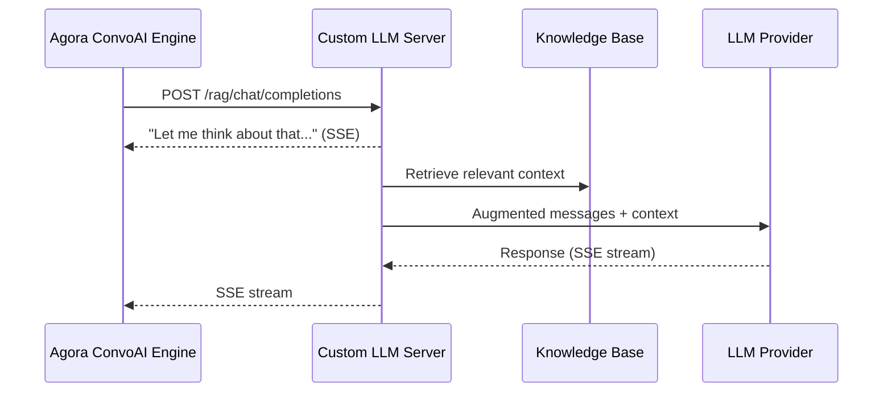

#  Custom LLM Server

OpenAI-compatible LLM proxy for [Agora Conversational AI](https://docs.agora.io/en/conversational-ai/overview). Sits between the Agora ConvoAI Engine and your LLM provider, giving you full control over the request/response pipeline — tool execution, conversation memory, RAG context injection, and message transformation.

Implementations in Python, Node.js, and Go — all provide the same OpenAI-compatible endpoints.

## Features

| Feature                                 | Python  | Node.js | Go      |
| --------------------------------------- | ------- | ------- | ------- |
| Streaming chat completions              | Yes     | Yes     | Yes     |
| Non-streaming chat completions          | Yes     | Yes     | Yes     |
| Server-side tool execution (multi-pass) | Yes     | Yes     | Yes     |
| Conversation memory (per-channel)       | Yes     | Yes     | Yes     |
| RAG retrieval (keyword-based)           | Yes     | Yes     | Yes     |
| Multimodal audio responses              | Yes     | Yes     | Yes     |
| Health check endpoint                   | `/docs` | `/ping` | `/ping` |
| RTM text messaging                      | --      | Yes     | --      |
| Audio subscriber (RTC audio capture)    | --      | Yes     | --      |
| Thymia voice biomarkers                 | --      | Yes     | --      |

## Quick Start

| Language | Framework         | Port | Guide                |
| -------- | ----------------- | ---- | -------------------- |
| Python   | FastAPI + uvicorn | 8100 | [python/](./python/) |
| Node.js  | Express           | 8101 | [node/](./node/)     |
| Go       | Gin               | 8102 | [go/](./go/)         |

## How It Works

The Agora ConvoAI Engine calls your Custom LLM Server instead of calling the LLM provider directly. Your server processes the request — adding conversation history, executing tools, injecting RAG context — then forwards to the LLM and streams the response back.



For RAG requests, the server retrieves relevant knowledge and injects it before calling the LLM:



## Endpoints

### `/chat/completions` — LLM Proxy with Tool Execution

Receives an OpenAI-compatible chat completion request, forwards it to the LLM provider, and relays the response back. Supports both streaming and non-streaming modes.

When the LLM returns `tool_calls`, the server executes them locally and sends the results back for a follow-up response. This loop runs up to 5 passes.

### `/rag/chat/completions` — RAG-Enhanced

Same as the basic endpoint but with a retrieval step before the LLM call:

1. Sends a "thinking" message to keep the connection alive
2. Retrieves relevant knowledge from the built-in knowledge base
3. Injects the retrieved context into the message list
4. Forwards the augmented messages to the LLM

### `/audio/chat/completions` — Multimodal Audio

Returns audio responses with transcript. Reads a text file for the transcript and a PCM file for the audio data, then streams them as SSE chunks.

## Environment Variables

All three languages use the same env vars with backward-compatible fallbacks:

| Variable       | Description              | Default                     |
| -------------- | ------------------------ | --------------------------- |
| `LLM_API_KEY`  | API key for LLM provider | _(required)_                |
| `LLM_BASE_URL` | LLM API base URL         | `https://api.openai.com/v1` |
| `LLM_MODEL`    | Default model name       | `gpt-4o-mini`               |

Legacy variables `YOUR_LLM_API_KEY` and `OPENAI_API_KEY` are also accepted as
fallbacks for `LLM_API_KEY`.

## Tool Execution

Each language includes two sample tools:

- **`get_weather`** — returns simulated weather for a city
- **`calculate`** — evaluates a math expression

Tools are defined in `tools.{py,js,go}`. To add your own:

1. Add the OpenAI-compatible function schema
2. Implement the handler `(appId, userId, channel, args) -> string`
3. Register it in the tool map

The server automatically detects `tool_calls` in LLM responses, executes them,
and sends the results back to the LLM. This works in both streaming and
non-streaming modes, with up to 5 passes for chained tool calls.

## Conversation Memory

Messages are stored in memory per `appId:userId:channel`. The Agora ConvoAI
Engine sends these values in the request `context` field:

```json
{
  "context": { "appId": "abc123", "userId": "user42", "channel": "room1" },
  "messages": [{ "role": "user", "content": "Hello" }],
  "stream": true
}
```

Conversation memory is on by default. Conversations are trimmed at 100 messages
(keeping 75 most recent) and cleaned up after 24 hours of inactivity.

## Expose Locally

When running locally, you need a tunnel to make the server reachable from the
Agora ConvoAI Engine (which runs in the cloud). Use
[cloudflared](https://developers.cloudflare.com/cloudflare-one/connections/connect-networks/get-started/create-local-tunnel/)
to create a free tunnel — no account required:

```bash
# Install (macOS)
brew install cloudflare/cloudflare/cloudflared

# Start the tunnel pointing to your server port
cloudflared tunnel --url http://localhost:8100
```

This outputs a public URL like `https://random-words.trycloudflare.com`. Use
that URL when configuring the Agora ConvoAI agent:

```json
{
  "llm": {
    "url": "https://random-words.trycloudflare.com/chat/completions",
    "api_key": "your-llm-api-key",
    "model": "gpt-4o-mini"
  }
}
```

## Testing

Each language has a test script in `test/` that covers happy paths and failure
paths. Tests validate server structure and error handling without requiring a
real LLM API key.

### Run all tests

```bash
bash test/run_all.sh
```

### Run a single language

```bash
bash test/run_all.sh python
bash test/run_all.sh node
bash test/run_all.sh go
```

See [test/README.md](./test/README.md) for full test coverage details.

## Integration

To use a Custom LLM Server with Agora Conversational AI:

1. Start your server and expose it via a tunnel:

```bash
cd python
python3 custom_llm.py
cloudflared tunnel --url http://localhost:8100
```

2. Configure the Agora ConvoAI agent to use your custom LLM endpoint in the
   agent start API call:

```json
{
  "llm": {
    "url": "https://your-tunnel.trycloudflare.com/chat/completions",
    "api_key": "your-llm-api-key",
    "model": "gpt-4o-mini"
  }
}
```

## Resources

- [Agora Conversational AI Docs](https://docs.agora.io/en/conversational-ai/overview) — ConvoAI Engine documentation
- [Agora Console](https://console.agora.io/) — Get your App ID and credentials
- [OpenAI Chat Completions API](https://platform.openai.com/docs/api-reference/chat) — API reference for the compatible format

## License

This project is licensed under the MIT License. See [LICENSE](./LICENSE).
